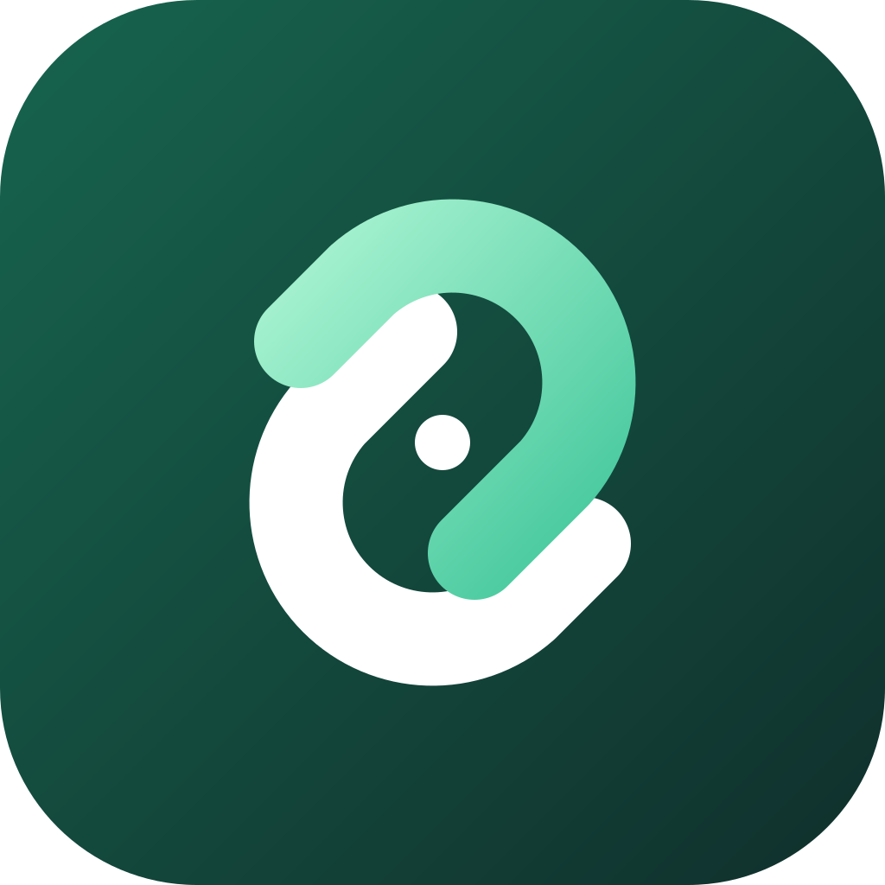
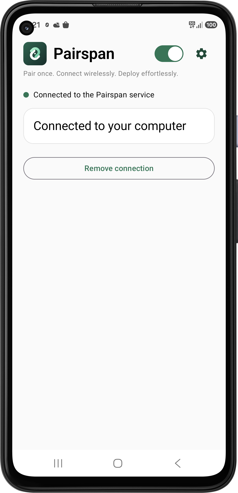
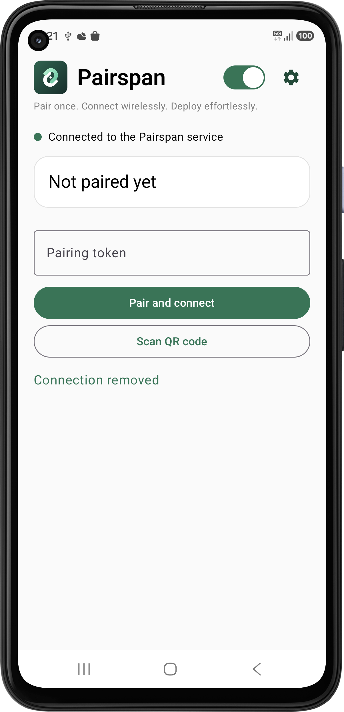
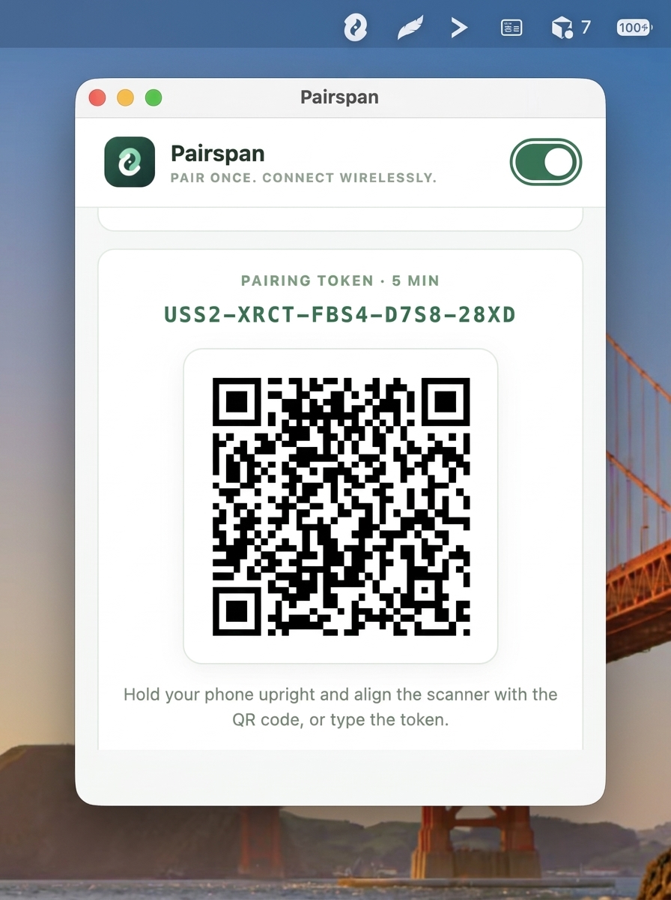

<p align="center">
  <a href="https://pairspan.ferhatozcelik.com">
    
  </a>
</p>

<h1 align="center">Pairspan</h1>

<p align="center">Verbinde dein Android-Smartphone über drahtloses ADB mit macOS oder Windows.</p>

<p align="center"><strong>Einmal koppeln. Drahtlos verbinden. Mühelos bereitstellen.</strong></p>

<p align="center">
  <a href="https://github.com/ferhatozcelik/pairspan/releases/tag/v1.0.0"></a>
  
  <a href="LICENSE"></a>
</p>

<p align="center">
  <a href="https://pairspan.ferhatozcelik.com">Website</a> ·
  <a href="https://github.com/ferhatozcelik/pairspan/releases/tag/v1.0.0">Download</a> ·
  <a href="#setup-guide">Einrichtung</a> ·
  <a href="CONTRIBUTING.md">Mitwirken</a>
</p>

<p align="center">
  <a href="README.md">English</a> ·
  <a href="README.tr.md">Türkçe</a> ·
  <a href="README.de.md">Deutsch</a> ·
  <a href="README.es.md">Español</a> ·
  <a href="README.fr.md">Français</a> ·
  <a href="README.pt-BR.md">Português (Brasil)</a> ·
  <a href="README.zh-CN.md">简体中文</a> ·
  <a href="README.ja.md">日本語</a>
</p>

<br>

<table align="center">
  <tr>
    <th align="center">Android · Verbunden</th>
    <th align="center">Android · Kopplung</th>
    <th align="center">macOS · QR-Code und Token</th>
  </tr>
  <tr>
    <td align="center" valign="top"></td>
    <td align="center" valign="top"></td>
    <td align="center" valign="top"></td>
  </tr>
</table>

## Download

[Version 1.0.0](https://github.com/ferhatozcelik/pairspan/releases/tag/v1.0.0): macOS, Windows und Android.

## Ordner

| Komponente | Ordner |
| --- | --- |
| Android | [`android/`](android/) |
| macOS und Windows | [`mac/`](mac/) |
| Web | [`web/`](web/) |

```bash
cd web && npm install && npm start
cd mac && npm install && npm start
cd android && ./gradlew :app:assembleDebug
```

<a id="setup-guide"></a>

## Einrichtung

Pairspan besteht aus einer Desktop-App (macOS oder Windows) und einer Android-App. Beide verbinden sich mit dem Gateway unter `https://pairspan.ferhatozcelik.com`. Smartphone und Computer müssen daher nicht im selben Netzwerk sein. Ein Computer kann mehrere Smartphones gleichzeitig verbinden.

### 1. Desktop-App installieren

**macOS**

1. Lade `pairspan-mac-1.0.0.dmg` von der [Release-Seite](https://github.com/ferhatozcelik/pairspan/releases/tag/v1.0.0) herunter und ziehe Pairspan in den Programme-Ordner.
2. Die App ist nicht notarisiert. Blockiert macOS den ersten Start, klicke mit der rechten Maustaste auf Pairspan und wähle **Öffnen**.
3. Pairspan läuft in der Menüleiste. Klicke auf das Symbol, um Kopplungstoken und QR-Code anzuzeigen.
4. `adb` ist enthalten; eine zusätzliche Installation ist nicht nötig.

**Windows**

1. Lade `pairspan-windows-1.0.0.exe` von derselben Release-Seite herunter und führe die Datei aus.
2. Das Installationsprogramm ist nicht signiert. Bei einer SmartScreen-Warnung wähle **Weitere Informationen → Trotzdem ausführen**.
3. Pairspan läuft im Infobereich. Klicke auf das Symbol, um Kopplungstoken und QR-Code anzuzeigen.
4. `adb.exe` ist enthalten.

Mit dem Schalter oben im Fenster oder **Enabled** im Menü des Infobereichs schaltest du Pairspan ein oder aus. Wenn es ausgeschaltet ist, können sich keine Smartphones verbinden.

### 2. Android-App installieren

1. Lade die APK von der Release-Seite herunter und installiere sie. Erlaube bei Bedarf Installationen über Browser oder Dateimanager. Erforderlich ist Android 8.0 oder neuer, für drahtloses Debugging Android 11 oder neuer.
2. Öffne Pairspan und erlaube Benachrichtigungen sowie Kamerazugriff. Die Kamera wird nur zum Scannen des QR-Codes verwendet.
3. Tippe unter **Einstellungen → Über das Telefon** siebenmal auf **Build-Nummer**. Aktiviere unter **Entwickleroptionen** das **USB-Debugging** und, falls verfügbar, **Drahtloses Debugging**.

### 3. Systemzugriff gewähren (einmalig)

Pairspan kann seine Bedienungshilfen, Benachrichtigungsdienste und drahtloses ADB ohne Umweg über die Einstellungen aktivieren. Android erlaubt dies erst, nachdem ein Computer `WRITE_SECURE_SETTINGS` gewährt hat. Die Desktop-App übernimmt das:

1. Verbinde das Smartphone per USB mit dem Computer. USB-Debugging muss aktiviert und Pairspan installiert sein.
2. Klicke im Bereich **One-time phone permission** auf **Find USB phones**.
3. Bestätige eine eventuelle USB-Debugging-Abfrage auf dem Smartphone und suche erneut.
4. Klicke unter deinem Smartphone auf **Grant permission**. Die App führt mit dem enthaltenen `adb` diese Befehle aus und schaltet ADB für die Verbindung ohne Kabel auf Port 5555 um:

```bash
adb shell pm grant com.pairspan android.permission.WRITE_SECURE_SETTINGS
adb tcpip 5555
```

5. Wähle auf dem Smartphone **Zulassen** und **Immer zulassen**. Du musst keine Befehle eingeben.

Hinweise:

- Die Berechtigung bleibt bis zur Deinstallation von Pairspan bestehen. Die Einstellung für Port 5555 gilt bis zum Neustart des Smartphones; danach erneut **Grant permission** anklicken.
- Bei einer Sicherheitsausnahme aktiviere **USB-Debugging (Sicherheitseinstellungen)** in den Entwickleroptionen und versuche es erneut (einige Xiaomi/Redmi/POCO-Geräte).
- Du kannst den Befehl auch mit einem anderen `adb` ausführen. Die Android-App zeigt ihn unter **Getting ready → System access** mit **Copy command** an.
- Bei Smartphones ohne drahtloses Debugging führe einmal per USB `adb tcpip 5555` aus. Pairspan verwendet diesen Port.

<a id="pair"></a>

### 4. Koppeln

1. Die Desktop-App muss eingeschaltet sein und **Connected to the Pairspan service** anzeigen.
2. Tippe in der Android-App auf **Scan QR code** und scanne den Desktop-Code oder gib das Kopplungstoken ein.
3. Unter **Connected devices** erscheinen die **Device ID** des Smartphones und die **Client ID** des Computers. Beide IDs stehen auch unter **Settings** in der Android-App.
4. Wiederhole die Kopplung mit einem neuen Code für weitere Smartphones. Ein verwendeter Code wird sofort ersetzt.

### 5. Selbst hosten

Desktop- und Android-App stellen ADB nicht direkt füreinander bereit. Beide verbinden sich mit dem Gateway in [`web/`](web/). Die öffentliche Adresse ist `https://pairspan.ferhatozcelik.com`. Starte für einen eigenen Server diesen Prozess und baue beide Apps mit derselben URL und demselben Token.

### Voraussetzungen

- Node.js 22 oder Docker.
- Ein Hostname mit TLS, wenn das Gateway aus dem Internet erreichbar ist. Die Clients verwenden `https://` und WebSocket `wss://…/ws`.
- Dasselbe `GATEWAY_TOKEN` für Server, Desktop-App und Android-App.

Sitzungen liegen im Arbeitsspeicher und gehen bei einem Neustart des Prozesses verloren. Das Gateway führt kein `adb` aus. Die Desktop-App führt es ausschließlich auf `127.0.0.1` aus.

### Umgebungsvariablen

`web/.env.example`, `mac/.env.example` und `android/.env.example` verwenden dieselben zwei Zeilen. Setze die öffentliche URL auf eine Adresse, die Smartphones und Computer erreichen können. Lass das Token in Git leer.

```text
GATEWAY_PUBLIC_URL=https://pairspan.example.com
GATEWAY_TOKEN=
```

`GATEWAY_PUBLIC_URL` wird in die Kopplungs-QR-Codes geschrieben. `GATEWAY_TOKEN` wird bei jedem `hello` gesendet. Ohne Server-Token kann jeder beitreten, der `/ws` erreicht. Erzeuge vor der Freigabe im Internet ein langes zufälliges Token:

```bash
openssl rand -hex 32
```

Committe das Token nicht. Hinterlege es in der Prozessumgebung oder für Docker in `web/temp.env`. `temp.env` gehört nicht ins Repository.

### Mit Node starten

```bash
cd web
npm install
export GATEWAY_PUBLIC_URL=https://pairspan.example.com
export GATEWAY_TOKEN='paste-the-token'
npm start
```

Der Prozess lauscht auf `0.0.0.0:3000` und stellt die Startseite, `/p/`, WebSocket `/ws` und `GET /health` bereit.

```bash
curl -fsS http://127.0.0.1:3000/health
```

Ein funktionierender Prozess antwortet mit `{"ok":true,"service":"pairspan",...}`.

### Mit Docker starten

Im Ordner `web/`:

```bash
docker build -t pairspan:latest .
```

Erstelle `web/temp.env`:

```text
NODE_ENV=production
GATEWAY_PUBLIC_URL=https://pairspan.example.com
GATEWAY_TOKEN=paste-the-token
```

[`web/docker-compose.yml`](web/docker-compose.yml) liest diese Datei und leitet `127.0.0.1:16200` auf Container-Port `3000` weiter.

```bash
docker compose up -d
curl -fsS http://127.0.0.1:16200/health
```

Setze einen TLS-Reverse-Proxy vor `127.0.0.1:16200` und leite WebSocket-Upgrades für `/ws` weiter. Prüfe auch die öffentliche URL:

```bash
curl -fsS https://pairspan.example.com/health
```

### Apps mit deinem Gateway verbinden

Trage dieselbe URL und dasselbe Token in `mac/.env.example` und `android/.env.example` ein und baue die Apps erneut. Die Desktop-App liest `.env.example` beim Start; Android übernimmt beide Werte beim Kompilieren in die APK.

```bash
cd mac && npm install && npm start
cd android && ./gradlew :app:assembleDebug
```

Ein Client mit einem anderen Token wird abgewiesen. Vor dem Scannen muss die Desktop-App **Connected to the Pairspan service** anzeigen. Folge anschließend den [Kopplungsschritten](#pair).

## 6. Relay verwenden

Jedes Smartphone erhält einen eigenen lokalen Port auf dem Computer, beginnend bei `127.0.0.1:44755`. Das Desktop-Fenster zeigt das jeweilige Ziel für `adb connect` an.

```bash
adb devices
adb -s 127.0.0.1:44755 shell id
```

Zeigt `adb devices` den Status `authorizing`, entsperre das Smartphone, bestätige die USB-Debugging-Abfrage und wähle **Immer zulassen**.

Tippe zum Trennen eines Smartphones in der Android-App auf **Remove connection**. Schalte den Desktop-Schalter aus, um alle Verbindungen zu trennen.

## Lizenz

[MIT](LICENSE)

## Sicherheit und verantwortungsvolle Nutzung

Verwende Pairspan nur auf eigenen Geräten oder mit ausdrücklicher Zugriffsberechtigung, für legitime Entwicklung, Fehlersuche und Geräteverwaltung. Nutze ADB nicht für unbefugten Zugriff, heimliche Überwachung, Datendiebstahl, Schadsoftware oder zum Umgehen von Sicherheitsmaßnahmen.

Bei der oben beschriebenen USB-Einrichtung muss der Geräteinhaber USB-Debugging aktivieren, das Smartphone entsperren und die Android-Autorisierung bestätigen. Erlaube nur vertrauenswürdige Computer. Kopplung und automatische Wiederverbindung müssen diese Autorisierung beachten und dürfen widerrufene Berechtigungen nicht umgehen. Siehe die [Android-ADB-Dokumentation](https://developer.android.com/tools/adb).

Halte Kopplungstoken und ADB-Schlüssel geheim. Entferne zum Beenden des Zugriffs die Pairspan-Verbindung und widerrufe die USB-Debugging-Autorisierungen in den Android-Entwickleroptionen. Deaktiviere Debugging, wenn es nicht mehr benötigt wird. Beachte das Android-Sicherheits- und Berechtigungsmodell sowie die geltende [Google-Play-Richtlinie zum Missbrauch von Geräten und Netzwerken](https://support.google.com/googleplay/android-developer/answer/16559646). Eine USB-Autorisierung allein belegt keine Einhaltung der Google-Play-Richtlinien.
